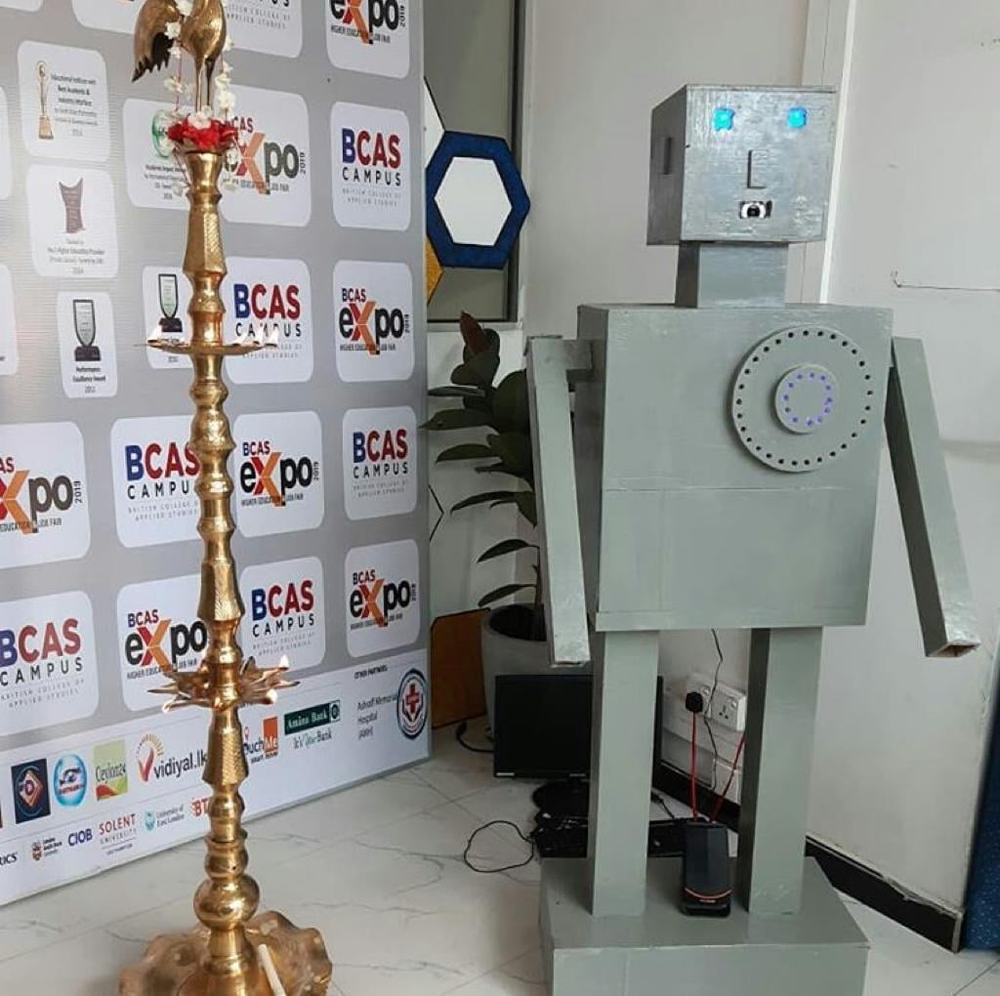
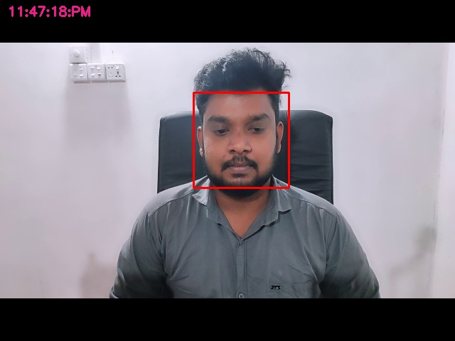
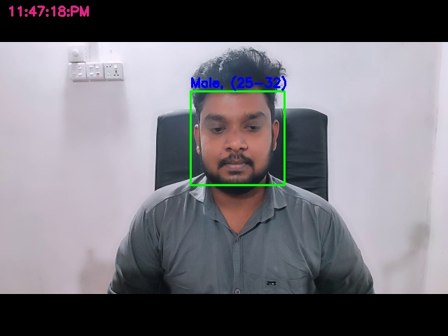
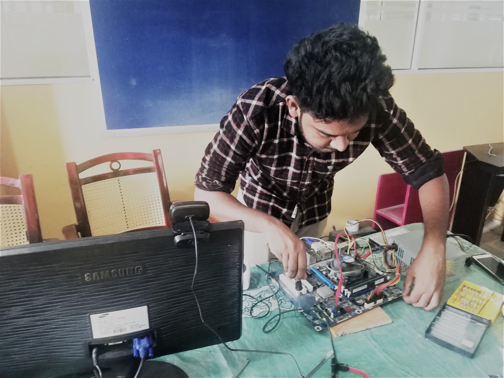

# Alpha-7 Welcome Robot

## Introduction

Alpha-7 is a simple robot for welcoming visitors, and it was developed for an exhibition program to welcome the exhibition's visitors; as a primary source, it uses face detection technology to confirm that people are detected.

It has three primary functions: welcoming visitors, predicting their age, and classifying gender using facial appearance and features. it uses "age-net.caffemodel" and "gender-net.caffemodel" models for performing these operations.

It is programmed to welcome women in male voices and men in female voices.





## Technology and Frameworks

- Python 3.6
- pyttsx3
- speech_recognition
- soundfile
- imutils
- pygame

## Configuration & Setup

- Install pyttsx3

  ```
  pip install pyttsx3
  ```

- Install speechRecognition

  ```
  pip install SpeechRecognition
  ```

- Install soundfile

  ```
  pip install soundfile
  ```

- Install imutils

  ```
  pip install imutils
  ```

- Install pygame

  ```
  pip install pygame
  ```


## Execution

  ```
  python run.py
  ```

## Outputs







## Reference



## Social Links

* [Linkedin Profile](https://www.linkedin.com/in/gunarakulangunaretnam)
* [Facebook Profile](https://www.facebook.com/gunarakulangr.page)
* [Instagram Profile](https://www.instagram.com/gunarakulangunaretnam)
* [Twitter Profile ](https://twitter.com/gunarakulangr)
* [Kaggle Profile](https://www.kaggle.com/gunarakulangr)
* [TikTok Profile](https://www.tiktok.com/@gunarakulangunaretnam)
* [Youtube Profile](https://www.youtube.com/channel/UCMWkED5sabgVZSCKjZuRJXA)
